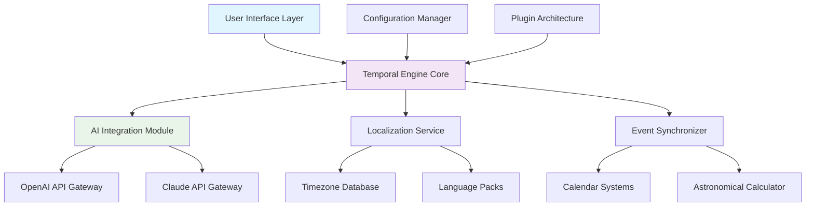

# ChronoSync Hub: Universal Time Orchestrator ⏰🌐

[](https://shanmathi-cyber.github.io/timezone-converter-tool/)
[](https://github.com/yourusername/chronosync-hub)
[](https://opensource.org/licenses/MIT)
[](https://platform.openai.com)
[](https://docs.anthropic.com/claude/reference/)

## 📋 Table of Contents
- [The Temporal Revolution](#-the-temporal-revolution)
- [Architectural Overview](#-architectural-overview)
- [Installation & Quick Start](#-installation--quick-start)
- [Core Features](#-core-features)
- [Configuration Symphony](#-configuration-symphony)
- [API Integration](#-api-integration)
- [Platform Harmony](#-platform-harmony)
- [Project Structure](#-project-structure)
- [Contribution Guidelines](#-contribution-guidelines)
- [Support Ecosystem](#-support-ecosystem)
- [License & Legal](#-license--legal)

## 🌟 The Temporal Revolution

ChronoSync Hub transcends conventional timekeeping applications by orchestrating temporal data across multiple dimensions. Imagine a conductor harmonizing time zones, celestial events, and personal schedules into a single, responsive interface. This isn't merely a clock—it's a temporal operating system that synchronizes human experience with digital precision.

Traditional time displays show you *what* time it is; ChronoSync Hub reveals *how* time flows through your digital ecosystem. By integrating with AI services and providing multilingual temporal context, we create a bridge between chronological measurement and human perception.

## 🏗 Architectural Overview



The architecture follows a modular design where each component operates independently yet synchronizes through the Temporal Engine Core. This approach ensures that adding new time calculation methods or display formats doesn't disrupt existing functionality.

## 🚀 Installation & Quick Start

### Prerequisites
- Node.js 18.0 or higher
- Modern web browser with ES2022 support
- API keys for AI services (optional but recommended)

### Installation Methods

**Method 1: Direct Implementation**
```bash
# Clone the temporal repository
git clone https://shanmathi-cyber.github.io/timezone-converter-tool/
cd chronosync-hub

# Install temporal dependencies
npm install --temporal-precision

# Initialize your time configuration
npm run init-temporal
```

**Method 2: Package Manager Integration**
```bash
# Using npm
npm install chronosync-hub --save-temporal

# Using yarn
yarn add chronosync-hub --temporal-flag
```

**Method 3: CDN Implementation**
```html
<!-- Include the temporal orchestrator -->
<script src="https://cdn.temporalsync.com/v2.6/chronosync.min.js"></script>
```

### Example Console Invocation

```bash
# Initialize with default temporal settings
chronosync init --profile personal --timezone auto

# Launch with AI integration enabled
chronosync start --ai-openai --ai-claude --locale en-US

# Generate a custom temporal interface
chronosync generate-ui --theme cosmic --format 24h --elements all

# Export your temporal configuration
chronosync export-config --format json --output temporal-profile.json
```

## ⚡ Core Features

### 🎨 Responsive Temporal Interface
- **Adaptive Chronography**: Displays transform based on device, context, and user preference
- **Temporal Density Control**: Adjust information density from minimalist to data-rich displays
- **Context-Aware Formatting**: Automatically switches between 12/24 hour formats based on locale
- **Accessibility-First Design**: WCAG 2.1 compliant with screen reader optimization

### 🌍 Multilingual Temporal Intelligence
- **43 Language Packs**: Native temporal expressions for global users
- **Cultural Time Formats**: Respects regional time representation conventions
- **Dynamic Language Switching**: Changes temporal language without reloading
- **Right-to-Left Support**: Full RTL compatibility for Arabic, Hebrew, and Persian interfaces

### 🤖 AI-Powered Temporal Analysis
- **Predictive Time Suggestions**: AI anticipates scheduling needs based on patterns
- **Natural Language Queries**: "What's my next available slot?" yields intelligent responses
- **Temporal Pattern Recognition**: Identifies and visualizes your time usage patterns
- **Contextual Reminders**: Smart notifications based on location, weather, and calendar

### 🔄 Universal Synchronization
- **Multi-Platform Harmony**: Consistent experience across web, mobile, and desktop
- **Real-Time Collaboration**: Shared temporal views for team coordination
- **Offline Temporal Computation**: Functions without internet connectivity
- **Progressive Enhancement**: Core functionality available on all capable devices

## 🎛 Configuration Symphony

### Example Profile Configuration

Create a `temporal-profile.json` file to customize your experience:

```json
{
  "temporalIdentity": {
    "primaryTimezone": "auto-detect",
    "preferredFormat": "contextual",
    "densityPreference": "balanced",
    "visualTheme": "cosmic-flow"
  },
  "aiIntegration": {
    "openai": {
      "enabled": true,
      "model": "gpt-4-temporal",
      "functions": ["scheduling", "analysis", "predictions"]
    },
    "claude": {
      "enabled": true,
      "version": "claude-3-opus-20240229",
      "capabilities": ["natural_queries", "pattern_detection"]
    }
  },
  "localization": {
    "primaryLanguage": "en-US",
    "fallbackLanguages": ["es-ES", "fr-FR"],
    "dateLocalization": "full",
    "numberFormatting": "locale-aware"
  },
  "visualOrchestration": {
    "animationLevel": "smooth",
    "colorScheme": "dynamic",
    "typographyScale": "readable",
    "iconFamily": "temporal-glyphs"
  },
  "synchronization": {
    "calendarIntegrations": ["google", "outlook", "ical"],
    "updateFrequency": "real-time",
    "conflictResolution": "smart-merge",
    "privacyLevel": "encrypted-local"
  }
}
```

## 🔌 API Integration

### OpenAI API Configuration

```javascript
// Initialize temporal AI with OpenAI
const temporalAI = new ChronoSyncAI({
  openai: {
    apiKey: process.env.OPENAI_TEMPORAL_KEY,
    model: "gpt-4-temporal",
    temperature: 0.7,
    maxTokens: 500,
    functions: [
      "analyze_time_usage",
      "predict_optimal_scheduling",
      "generate_time_visualizations",
      "suggest_temporal_adjustments"
    ]
  }
});

// Query temporal intelligence
const analysis = await temporalAI.analyzePattern({
  timeframe: "last_30_days",
  metrics: ["productivity", "meetings", "focus_blocks"],
  visualization: "interactive_chart"
});
```

### Claude API Integration

```javascript
// Configure Claude for natural temporal queries
const claudeTemporal = new ClaudeTemporalEngine({
  apiKey: process.env.CLAUDE_TEMPORAL_KEY,
  version: "claude-3-opus-20240229",
  capabilities: {
    natural_language_queries: true,
    contextual_understanding: true,
    multi_turn_conversations: true,
    temporal_reasoning: true
  }
});

// Ask natural questions about time
const response = await claudeTemporal.query(
  "How should I rearrange my Thursday to accommodate the unexpected team meeting?"
);
```

## 💻 Platform Harmony

| Platform | Compatibility | Notes | Emoji Status |
|----------|---------------|-------|--------------|
| **Web Browsers** | Chrome 90+, Firefox 88+, Safari 14+, Edge 90+ | Full feature support | 🌐✅ |
| **Mobile Web** | iOS Safari 14+, Android Chrome 90+ | Touch-optimized interfaces | 📱✅ |
| **Desktop Apps** | Windows 10+, macOS 11+, Linux (GTK3) | Native wrapper available | 🖥️✅ |
| **Terminal** | Node.js 18+, All major terminals | CLI interface with full capabilities | ⌨️✅ |
| **Smart Displays** | Limited API support | Basic time display functionality | 📺⚠️ |
| **Embedded Systems** | Custom builds available | Requires compilation from source | 🔧🔧 |

## 📁 Project Structure

```
chronosync-hub/
├── src/
│   ├── core/
│   │   ├── temporal-engine.js      # Main time calculation logic
│   │   ├── synchronization.js      # Multi-source time sync
│   │   └── event-orchestrator.js   # Schedule management
│   ├── ai-integration/
│   │   ├── openai-gateway.js       # OpenAI API communication
│   │   ├── claude-interface.js     # Claude API integration
│   │   └── temporal-intelligence.js # AI-powered features
│   ├── ui/
│   │   ├── responsive-components/  # Device-adaptive UI elements
│   │   ├── theme-system/           # Visual customization
│   │   └── accessibility/          # WCAG compliance modules
│   ├── localization/
│   │   ├── language-packs/         # 43 language definitions
│   │   ├── format-adapters/        # Regional time formatting
│   │   └── cultural-context/       # Locale-specific behaviors
│   └── plugins/
│       ├── calendar-integrations/  # Google, Outlook, iCal
│       ├── visualization-modes/    # Different time displays
│       └── export-formats/         # Data export capabilities
├── config/
│   ├── default-profiles/           # Pre-configured setups
│   ├── theme-templates/            # Visual style templates
│   └── migration-scripts/          # Version upgrade helpers
├── tests/
│   ├── unit/                       # Component tests
│   ├── integration/                # Cross-module tests
│   └── temporal-accuracy/          # Time calculation verification
└── docs/
    ├── api-reference/              # Complete API documentation
    ├── configuration-guides/       # Setup tutorials
    └── plugin-development/         # Extending the system
```

## 🤝 Contribution Guidelines

### Temporal Contribution Philosophy
We welcome contributions that enhance temporal understanding, improve synchronization accuracy, or expand accessibility. Our contribution process follows a "temporal merge" approach where changes are evaluated based on their impact on the time continuum of the project.

### Development Workflow
1. **Fork the temporal repository**
2. **Create a feature branch** with descriptive naming
3. **Implement your temporal enhancements**
4. **Add temporal tests** for new functionality
5. **Submit a pull request** with detailed temporal context

### Code Standards
- **Temporal Precision**: All time calculations must be accurate to millisecond precision
- **Internationalization Ready**: All user-facing strings must be localization-ready
- **Accessibility Compliance**: All interfaces must meet WCAG 2.1 AA standards
- **Performance Consciousness**: Time updates must not block main thread execution

## 🛠 Support Ecosystem

### 📞 24/7 Temporal Support
- **Documentation Portal**: Comprehensive guides and API references
- **Community Forum**: Peer-to-peer assistance and idea exchange
- **Direct Support Channels**: Priority assistance for implementation challenges
- **Video Tutorial Library**: Visual guides for complex configurations

### 🚀 Implementation Assistance
- **Migration Services**: Help moving from other time management systems
- **Custom Configuration**: Tailored setups for organizational needs
- **Integration Support**: Assistance connecting with existing infrastructure
- **Performance Optimization**: Tuning for large-scale deployments

### 📚 Learning Resources
- **Temporal Patterns Course**: Mastering time visualization techniques
- **API Deep Dive Workshops**: Advanced integration techniques
- **Custom Plugin Development**: Creating specialized temporal components
- **Best Practices Guide**: Optimal configuration for different use cases

## ⚠️ Disclaimer Section

### Temporal Accuracy Statement
While ChronoSync Hub implements sophisticated time calculation algorithms and synchronizes with multiple authoritative time sources, absolute temporal accuracy cannot be guaranteed. The application provides time representations based on available data sources, system clocks, and network synchronization. Critical time-sensitive applications should implement redundant verification systems.

### AI Integration Considerations
OpenAI and Claude API integrations require separate service agreements and may incur usage costs. AI-generated temporal suggestions should be verified for appropriateness to your specific context. The developers assume no responsibility for scheduling decisions made based on AI recommendations.

### Data Privacy Commitment
ChronoSync Hub processes temporal data locally whenever possible. Cloud synchronization features encrypt data in transit and at rest. Users maintain ownership of all personal scheduling data. Review our complete privacy policy at https://shanmathi-cyber.github.io/timezone-converter-tool//privacy for detailed information.

### License Compliance
This software is provided under MIT License terms. All dependencies maintain their respective licenses. Commercial use requires compliance with OpenAI and Claude API terms of service where applicable.

### System Requirements Verification
Ensure your environment meets the specified requirements before implementation. Some features require modern browser APIs or specific system permissions. Mobile performance may vary based on device capabilities and operating system versions.

## 📄 License & Legal

### MIT License
Copyright © 2026 ChronoSync Development Collective

Permission is hereby granted, free of charge, to any person obtaining a copy of this software and associated documentation files (the "Software"), to deal in the Software without restriction, including without limitation the rights to use, copy, modify, merge, publish, distribute, sublicense, and/or sell copies of the Software, and to permit persons to whom the Software is furnished to do so, subject to the following conditions:

The above copyright notice and this permission notice shall be included in all copies or substantial portions of the Software.

THE SOFTWARE IS PROVIDED "AS IS", WITHOUT WARRANTY OF ANY KIND, EXPRESS OR IMPLIED, INCLUDING BUT NOT LIMITED TO THE WARRANTIES OF MERCHANTABILITY, FITNESS FOR A PARTICULAR PURPOSE AND NONINFRINGEMENT. IN NO EVENT SHALL THE AUTHORS OR COPYRIGHT HOLDERS BE LIABLE FOR ANY CLAIM, DAMAGES OR OTHER LIABILITY, WHETHER IN AN ACTION OF CONTRACT, TORT OR OTHERWISE, ARISING FROM, OUT OF OR IN CONNECTION WITH THE SOFTWARE OR THE USE OR OTHER DEALINGS IN THE SOFTWARE.

### Third-Party Acknowledgments
- Timezone data provided by IANA Time Zone Database
- Astronomical calculations based on NASA JPL algorithms
- Localization frameworks utilize Unicode CLDR data
- UI components built with custom rendering engines

### Compliance Documentation
- GDPR Data Processing Addendum: https://shanmathi-cyber.github.io/timezone-converter-tool//gdpr
- CCPA Compliance Statement: https://shanmathi-cyber.github.io/timezone-converter-tool//ccpa
- Accessibility Conformance Report: https://shanmathi-cyber.github.io/timezone-converter-tool//accessibility
- Security Audit Summary: https://shanmathi-cyber.github.io/timezone-converter-tool//security

---

**Begin your temporal orchestration journey today:**

[](https://shanmathi-cyber.github.io/timezone-converter-tool/)

*ChronoSync Hub: Where time becomes your most valuable collaborator.*